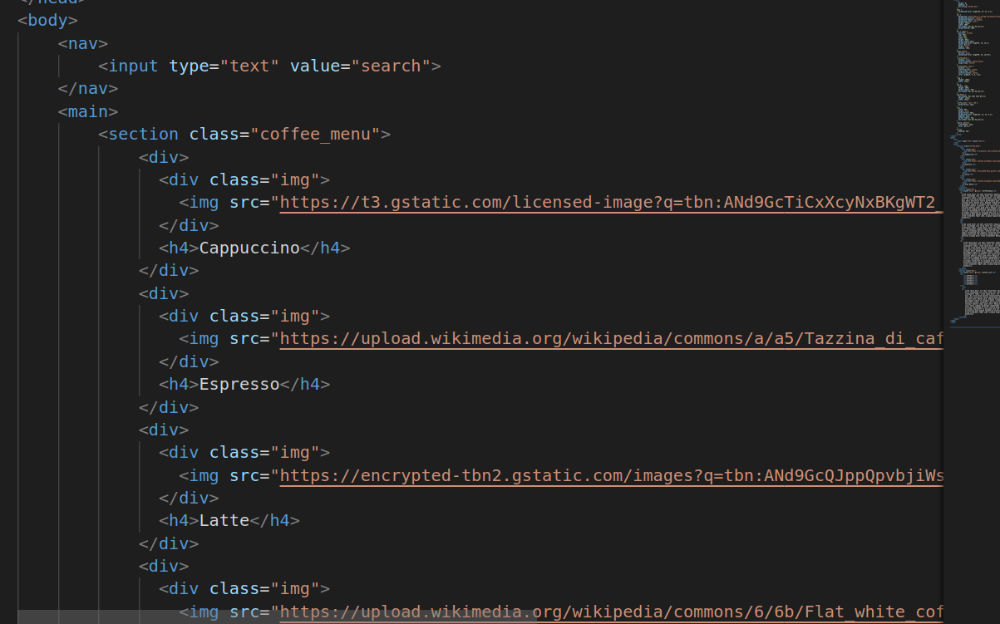
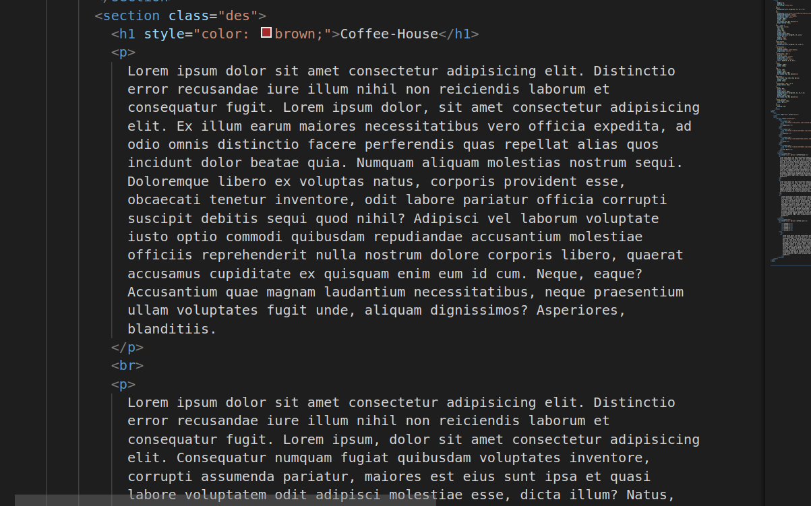
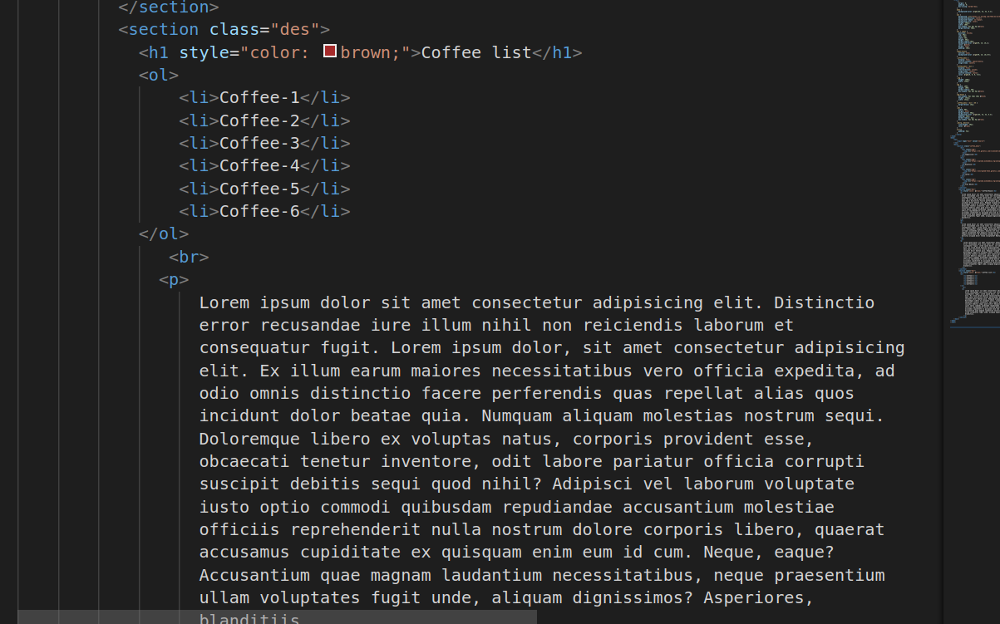
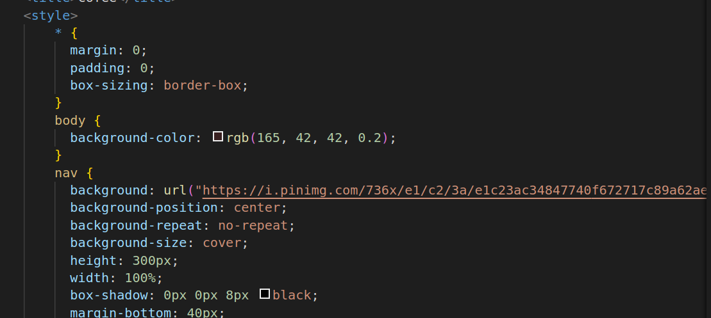
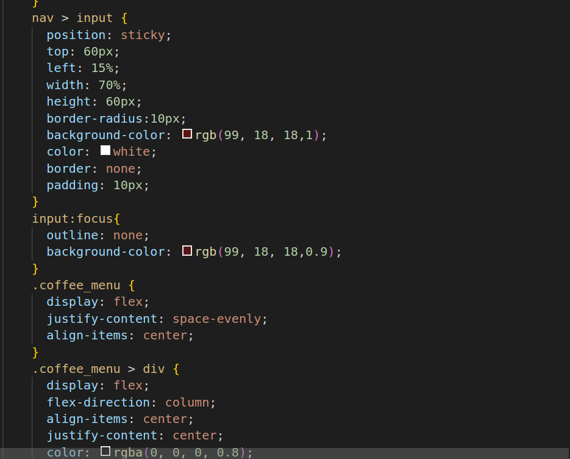
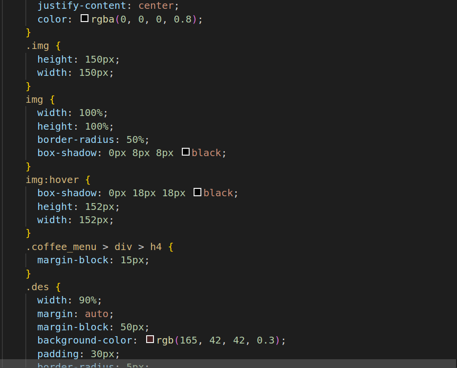
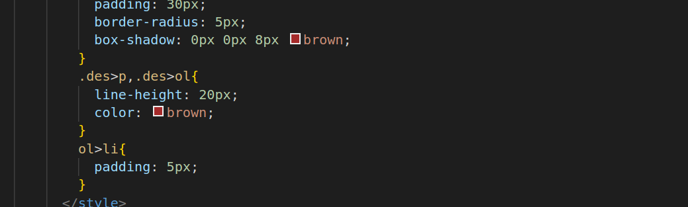

# Cofee_House

1.
* The nav represents the navigation section of the web page. It is often used for menus, search bars, and other navigation-related content.
* An input element is used to create an input field, typically for user input. In this case, it's used for a search bar.
* The main element represents the main content of the web page, excluding headers, footers, and sidebars.
* The section element is used to define sections or groups of content within the main content of the web page.
* The div element is a generic container for grouping and styling HTML elements. It's often used to structure and style content.
* The img element is used to embed images in the web page.

2.

3.
* h1,h4 :These are header elements used to define headings with different levels of importance. h1 is typically the highest level, and h4 is a lower-level heading.
* The paragraph element is used to define text paragraphs.
* An ordered list element is used to create a numbered list.
* The list item element is used within ordered or unordered lists to define individual list items

4.
* *: This is a universal selector that selects all elements on the page. It's used to reset margins, padding, and box-sizing for all elements to ensure consistent styling.
* margin, padding: These properties are used to control the spacing around elements. In this case, they are set to zero to remove default spacing.
* box-sizing: This property controls how the box model is calculated for elements. border-box ensures that the element's padding and border are included in its total width and height.
* background-color: Sets the background color of the body element.
* background: This property is used to set a background image for the navigation bar.
* background-position, background-repeat, background-size: These properties control how the background image is displayed and positioned.

5.

6.

7.

* height, width: These properties set the height and width of the navigation bar.
* box-shadow: Adds a shadow effect to the navigation bar.
* position: Sets the position property of the input element to "sticky," which allows it to stick to the top of the screen when scrolling.
* top, left: These properties are used to position the sticky input element.
* border-radius: Adds rounded corners to the input element.
* color: Sets the text color.
* border: Adds a border to the input element.
* display, justify-content, align-items: These properties are used to control the layout and alignment of elements within the .coffee_menu section.

  # Hosted Link
  https://nikhitha5511.github.io/Cofee_House/?authuser=0
* height, width: These properties set the dimensions of the coffee images.
* box-shadow: Adds a shadow effect to the images when hovered.
* margin-block: Adds margin to the headings within the .coffee_menu section.
* background-color, padding, border-radius: These properties are used to style the .des sections.
* line-height: Controls the spacing between lines of text.
